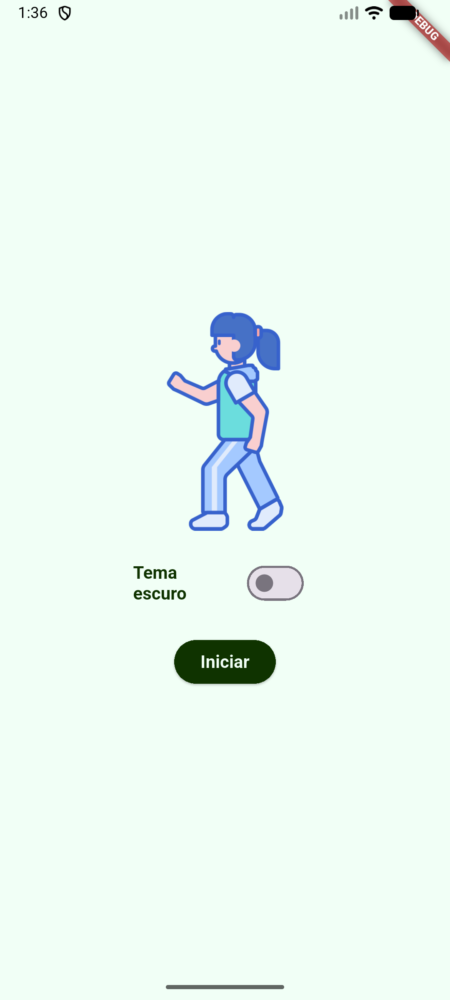
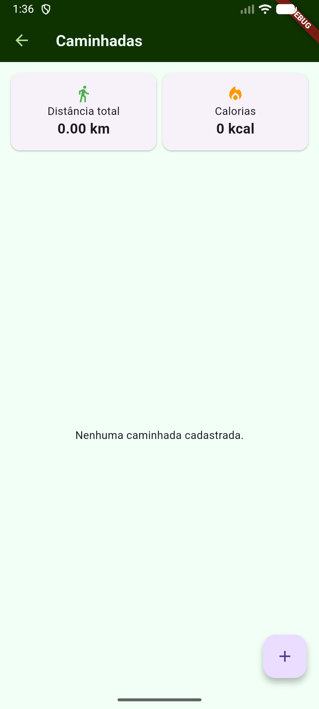
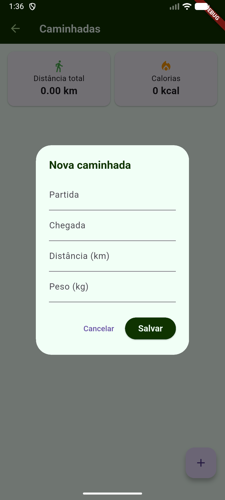
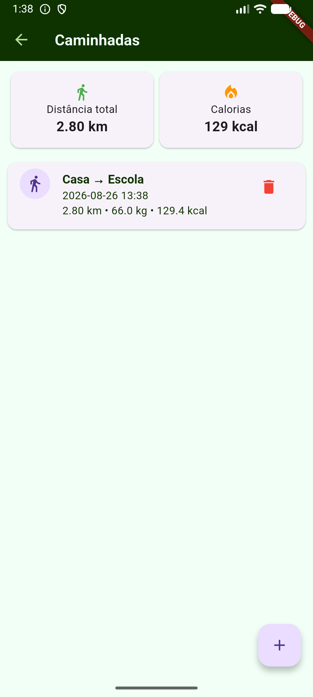
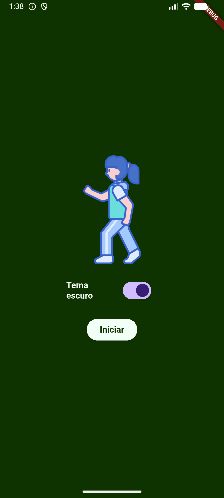
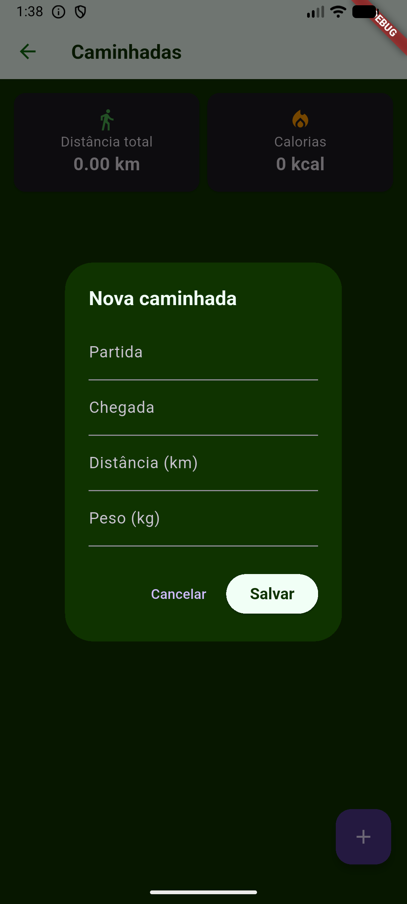
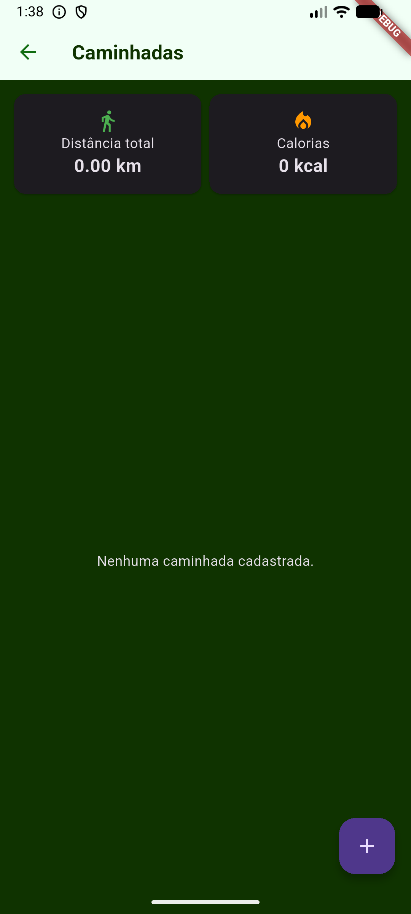
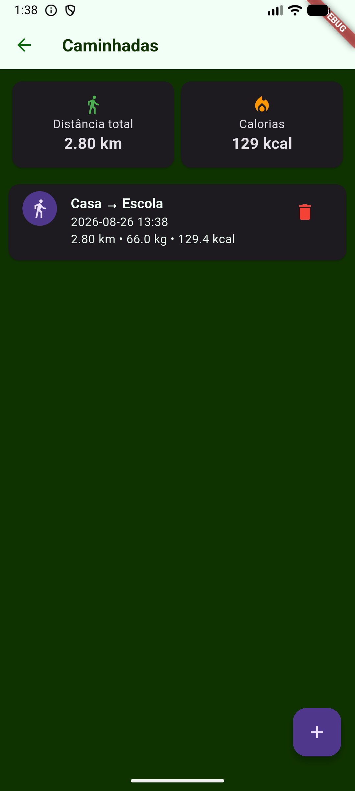

# Caminhada x Caloria

## Tópicos
- Como executar
- Prints das telas

## Como executar
- Rode o seguinte comando para instalar as dependências:
    ``` 
    flutter pub get
    ```
- Depois para depurar o código utilize o comando:
    ```
    flutter run
    ```

## Prints das Telas
|Tema|Tela Splash|Tela Home|Dialog Cadastrar|Tela Home com listagem|
|:-:|:-:|:-:|:-:|:-:|
|Claro|||||
|Escuro|||||